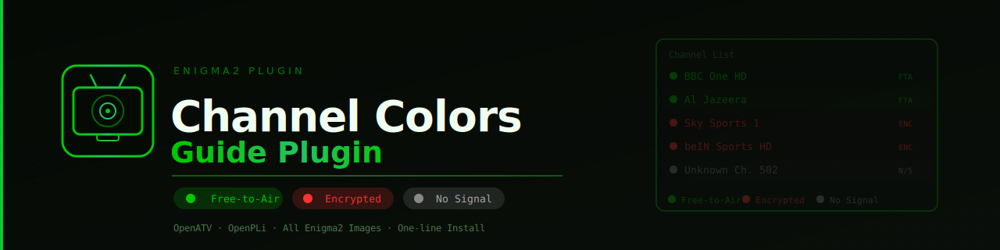

# Enigma2 Channel Colors Plugin



> Colorize your Enigma2 channel list by encryption state — instantly see which channels are **FTA**, **encrypted**, or have **no signal**.


## Visual Result

| Color | State |
|-------|-------|
| 🟢 Green `#00C800` | Free-to-Air (FTA) |
| 🔴 Red `#FF3232` | Encrypted |
| ⚫ Gray `#888888` | No Signal |

All colors configurable via **Menu → Plugins → Channel Colors**.

---

## Compatibility

| Image | Status |
|-------|--------|
| OpenATV 7.x | ✅ Tested & Working |
| OpenPLi 9.x | ✅ Compatible |
| BlackHole 3.x | ⚠️ Untested |
| VTi 14.x | ⚠️ Untested |

---

## Install

```sh
wget -q "--no-check-certificate" https://raw.githubusercontent.com/SamoTech/enigma2-channel-color-guide/main/install.sh -O - | sh
```

> Automatically detects your image path (live or ImageBoot), copies plugin files,
> patches the skin, and fixes any saved white FTA color.

### ⚠️ Required Skin Patch

If your skin has `foregroundColor="white"` hardcoded in the channel list widget
(e.g. **Fury-FHD**), colors will not show without this patch.
`install.sh` applies it automatically. To apply manually:

```sh
# Replace Fury-FHD with your skin folder name
SKIN="/usr/share/enigma2/Fury-FHD/skin.xml"
cp "$SKIN" "$SKIN.bak"

python3 << 'EOF'
path = '/usr/share/enigma2/Fury-FHD/skin.xml'
with open(path, 'r', encoding='utf-8', errors='replace') as f:
    c = f.read()
old = 'foregroundColor="white" foregroundColorSelected="#ffffff"'
new = 'foregroundColorSelected="#ffffff"'
if old in c:
    c = c.replace(old, new, 1)
    with open(path, 'w', encoding='utf-8') as f:
        f.write(c)
    print('Skin patched OK')
else:
    print('Pattern not found - check your skin manually')
EOF
```

---

## Uninstall

```sh
wget -q "--no-check-certificate" https://raw.githubusercontent.com/SamoTech/enigma2-channel-color-guide/main/uninstall.sh -O - | sh
```

> Removes the plugin and automatically restores the skin backup.

---

## Restore Skin Backup

```sh
wget -q "--no-check-certificate" https://raw.githubusercontent.com/SamoTech/enigma2-channel-color-guide/main/restore.sh -O - | sh
```

> Lists all available backups and lets you pick which one to restore.
> The backup `skin.xml.bak` is created automatically by `install.sh`.

---

## Configuration

Go to **Menu → Plugins → Channel Colors**:

| Setting | Default | Description |
|---------|---------|-------------|
| Plugin Enabled | Yes | Enable/disable without uninstalling |
| Encrypted Channel Color | `#FF3232` | Channels with CA/encryption |
| Decrypted Channel Color | `#FFD700` | Reserved for future NCam integration |
| Free-to-Air Channel Color | `#00C800` | Channels with no encryption |

**Color format:** `#RRGGBB` hex — e.g. `#FF0000` = red, `#00FF00` = bright green.

---

## Debug

```sh
# View plugin log
cat /tmp/cc_debug.log

# Watch in real-time
tail -f /tmp/cc_debug.log
```

Expected healthy output:
```
[ChannelColors] start
[ChannelColors] patched OK
[ChannelColors] FTA=347 ENC=590
[ChannelColors] apply done
```

---

## How It Works

- Hooks into `ChannelSelectionBase.__init__` at enigma2 startup
- Uses `eServiceCenter.info().isCrypted()` to detect FTA vs encrypted (reads lamedb)
- Sets `eListbox.setForegroundColor(enc_col)` as base color for all rows
- Marks FTA channels with `addMarked()` → `markedForeground` colors them green
- Patches `applySkin()` to survive every `setRoot()` skin re-apply
- Works around skin hardcoded `foregroundColor="white"` override

## Technical Notes

### `setColor(slot, color)` — Correct API

```python
l.setColor(l.markedForeground, parseColor("#00C800"))   # correct
l.setColor(0, parseColor("#00C800"))                    # WRONG
```

Slot constants are integer properties on the `eListboxServiceContent` object itself.

### Skin `foregroundColor="white"` Override

Many skins hardcode `foregroundColor="white"` on the service list widget.
This overrides all `setColor()` content slots. Must be removed from `skin.xml`.

### `applySkin` Hook

`setRoot()` triggers `applySkin()` which resets the listbox foreground back to
the skin color. Patching `sl.applySkin` reapplies our colors after every reset.

---

## License

MIT © [Ossama Hashim (SamoTech)](https://github.com/SamoTech)
